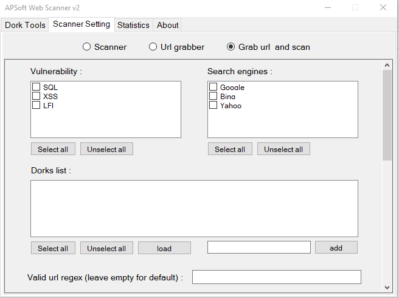
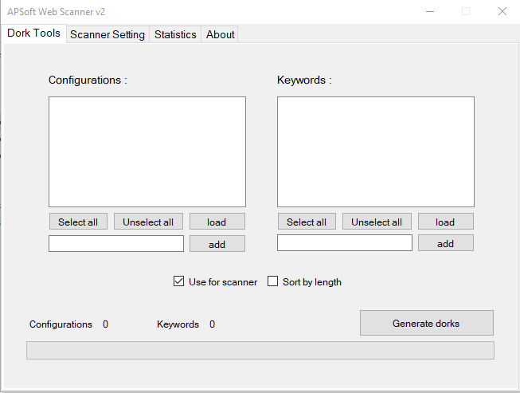
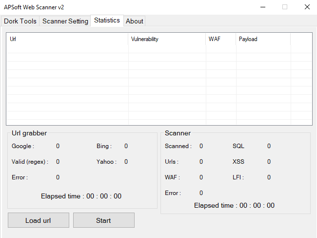

# APSoft Webscanner Version 2
new version of [APSoft Webscanner Version 1](https://github.com/APTeamOfficial/APSoft-WebScanner)

## Software pictures 

## What can i do with this ?
with this software, you will be able to search your dorks in **supported search engines** and scan grabbed urls to find their vulnerabilities.
in addition , you will be able to generate dorks, scan urls and saerch dorks separately when ever you want 

## Supported search engines
- Google
- Yahoo
- Bing

## Supported vulnerabilities
- SQL Injection
- XSS
- LFI

## Whats new in version 2 (most important updates) ?

### adding custom payloads
you can edit **payloads.json** file which will be created when you open and close software once, and add payloads as much as you want , easier than drinking water

### adding custom error checks
once a payload injected in url, software will looks for errors in new website source, you can also customize those errors too.
what you have to do is easily edit **payloadserror.json** file which will be created when you open and close software once.

### multy vulnerability check
in old version, you were not able to choose more than 1 vulnerabilites to check, but in v2, you can do this easily.

### multy search engine grabber
in old version, you were not able to choose more than 1 saerchengines to saerch in, but in v2, you can do this easily.

### memory management
we`ve added memory management to avoid lack of memory in your system

## updates list (all)
- new threading system based on microsoft task
- using linq technology
- dork generator part
- ability to add regexes as payloads error
- low usage
- moving from WPF to Windows form (just because my designes are bad, contact me if you can do better)
- ability to use scanner-graber separately and simultaneously
- and ....

### Donation : 19aXmEGbnsLwBTyDR6RCTBmSoegmNHzC9s
### support / suggestion = ph09nixom@gmail.com - t.me/ph09nix
### Leave a STAR if you found this usefull :)